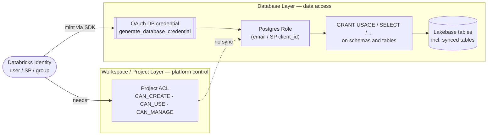
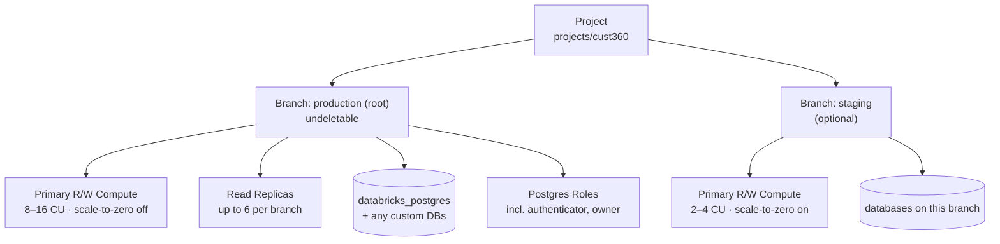
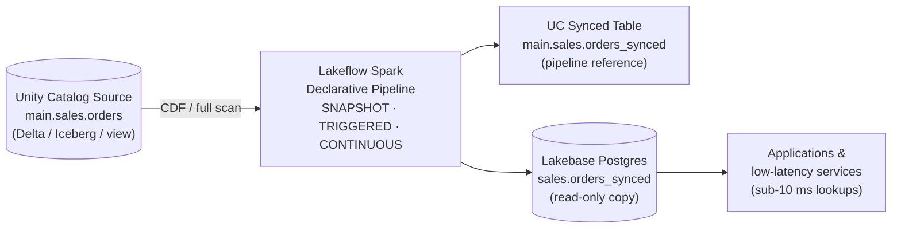
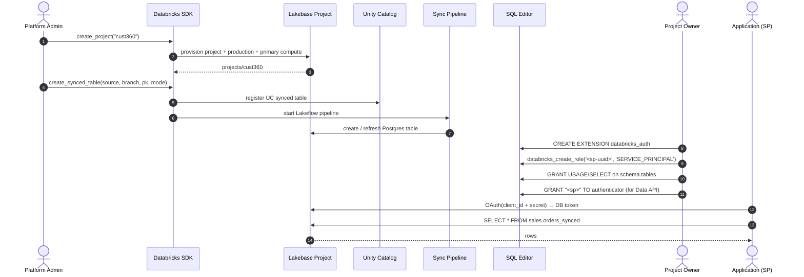
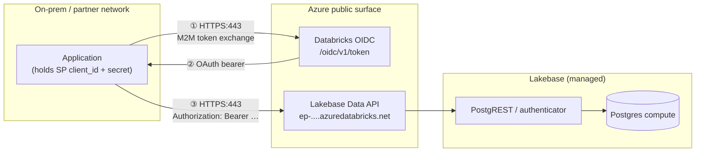
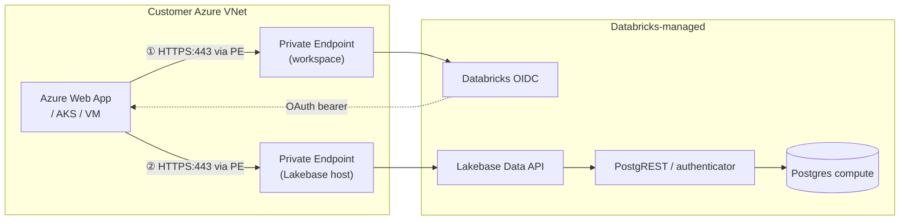
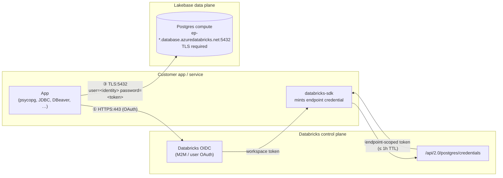

# Data Access Patterns — Lakebase Autoscaling

End-to-end playbook for serving lakehouse data through Lakebase Postgres in an enterprise setup. Covers project provisioning, table sync, compute/autoscaling management, the two-layer permission model, and — most importantly — concrete **connection patterns** for the surfaces apps actually reach for: the Data API (REST) and direct Postgres (JDBC/psycopg).

Everything uses the Databricks Python SDK (`databricks-sdk`) against Lakebase Autoscaling. All SDK snippets assume:

```python
from databricks.sdk import WorkspaceClient
w = WorkspaceClient()   # ambient auth — no host/profile in a notebook
```

See [Databricks SDK auth docs](https://learn.microsoft.com/en-gb/azure/databricks/oltp/projects/authentication) for local/CI alternatives.

For a task-oriented lookup + FAQ, skip to [`docs/quick_reference.md`](quick_reference.md).

---

## Table of contents

- [Authentication model at a glance](#authentication-model-at-a-glance)
- [1. Create a Lakebase project (SDK)](#1-create-a-lakebase-project-sdk)
- [2. Sync lakehouse tables into Lakebase (standardized path)](#2-sync-lakehouse-tables-into-lakebase-standardized-path)
  - [Prerequisites](#prerequisites)
  - [Pick a sync mode](#pick-a-sync-mode)
  - [Create (Python SDK)](#create-python-sdk)
  - [Re-sync (for SNAPSHOT and TRIGGERED)](#re-sync-for-snapshot-and-triggered)
  - [Check status](#check-status)
  - [Capacity rules of thumb](#capacity-rules-of-thumb)
  - [Delete](#delete)
- [3. Lakebase Autoscaling — computes & autoscaling summary](#3-lakebase-autoscaling--computes--autoscaling-summary)
  - [Programmatic management](#programmatic-management)
- [4. Granting users access to synced tables](#4-granting-users-access-to-synced-tables)
  - [Step A — Project permission (platform layer)](#step-a--project-permission-platform-layer)
  - [Step B — Postgres role + GRANTs (data layer)](#step-b--postgres-role--grants-data-layer)
  - [Step C — Give them a connection path](#step-c--give-them-a-connection-path)
  - [End-to-end provisioning sequence](#end-to-end-provisioning-sequence)
  - [Role sanity-check queries](#role-sanity-check-queries)
  - [UI gotcha when provisioning data-layer roles](#ui-gotcha-when-provisioning-data-layer-roles)
- [5. Connection patterns](#5-connection-patterns)
  - [5.1 Connecting via the Data API](#51-connecting-via-the-data-api)
  - [5.2 Network patterns — external apps → Data API](#52-network-patterns--external-apps--data-api)
  - [5.3 External apps connecting directly to Postgres](#53-external-apps-connecting-directly-to-postgres)
- [6. Recommended enterprise patterns](#6-recommended-enterprise-patterns)
- [References](#references)

---

## Authentication model at a glance

Lakebase has **two independent permission layers**. Forgetting this is the #1 source of "I can't read the table" tickets.



| Layer              | Controls                                                 | Granted via                                                  | Auth mechanism                       |
|--------------------|----------------------------------------------------------|--------------------------------------------------------------|--------------------------------------|
| **Workspace / project** | Who can *manage* the project (create branches, computes, etc.) | Lakebase UI → **Project settings → Project permissions**, or the project ACL API | Databricks OAuth (workspace)         |
| **Database (Postgres)** | Who can *read/write* data in the DB                          | Postgres `GRANT` statements in SQL Editor / psql             | Postgres role (OAuth or password)    |

Neither layer implies the other — note the dashed "no sync" arrow. A `CAN_MANAGE` user still gets zero rows out of `SELECT * FROM orders` until a Postgres role exists and has `SELECT` on the table.

---

## 1. Create a Lakebase project (SDK)

```python
from databricks.sdk import WorkspaceClient
from databricks.sdk.service.postgres import Project, ProjectSpec

w = WorkspaceClient()

op = w.postgres.create_project(
    project=Project(spec=ProjectSpec(
        display_name="Customer 360 Serving",
        pg_version=17,
        budget_policy_id="<optional-serverless-usage-policy-id>",
    )),
    project_id="cust360",   # becomes projects/cust360
)
project = op.wait()
print(project.name, project.status.display_name, project.status.pg_version)
```

What you get on creation:

- `projects/<id>` as the top-level container.
- A `production` branch (root, undeletable).
- A primary R/W compute on `production`, default range **8–16 CU**, scale-to-zero **off** (always active).
- The `databricks_postgres` Postgres database on `production`.
- A Postgres role matching the creator's Databricks identity (e.g. `user@databricks.com`), owning `databricks_postgres`.

Resource hierarchy under a project:



A project is workspace-scoped — the Postgres OAuth tokens that will connect to it must be minted from the same workspace.

Managing:

```python
# Inspect
w.postgres.get_project(name="projects/cust360")
for p in w.postgres.list_projects():
    print(p.name, p.status.display_name)

# Update (uses a FieldMask; include every path you set on spec)
from databricks.sdk.service.postgres import FieldMask
w.postgres.update_project(
    name="projects/cust360",
    update_mask=FieldMask(field_mask=["spec.display_name"]),
    project=Project(spec=ProjectSpec(display_name="Customer 360 — Prod")),
).wait()

# Destroy (CASCADES: branches, computes, databases, roles, data)
w.postgres.delete_project(name="projects/cust360")
```

Limits worth knowing at enterprise scale: 1000 projects per workspace, 500 branches/roles/databases per project, 8 TB logical data per branch, 20 concurrently active computes (default branch exempt). [Full list](https://learn.microsoft.com/en-gb/azure/databricks/oltp/projects/manage-projects#project-limits).

---

## 2. Sync lakehouse tables into Lakebase (standardized path)

The recommended, repeatable flow is **Unity Catalog synced tables via the Postgres SDK**. It replaces ad-hoc reverse-ETL scripts and keeps lineage under UC.

What happens under the hood: for each synced table you get (a) a UC-managed synced-table object that represents the pipeline, and (b) a Postgres table in Lakebase that your apps query.



### Prerequisites

- A Lakebase project and a target branch (usually `production`).
- A Unity Catalog table (managed or external Delta, Iceberg, view, or materialized view).
- UC: **USE_SCHEMA** + **CREATE_TABLE** on the target UC schema.
- For **Triggered** or **Continuous** modes, enable Change Data Feed on the source:

    ```sql
    ALTER TABLE main.sales.orders
    SET TBLPROPERTIES (delta.enableChangeDataFeed = true);
    ```

### Pick a sync mode

| Mode         | Use when                                                                               | Cost vs latency                                    |
|--------------|----------------------------------------------------------------------------------------|----------------------------------------------------|
| `SNAPSHOT`   | Source changes >10% of rows per cycle; source is a view or Iceberg; full daily refresh | Cheapest, highest lag                              |
| `TRIGGERED`  | Rows change on a known cadence; want incremental updates                               | Balanced; intervals <5 min get expensive           |
| `CONTINUOUS` | Sub-second freshness required                                                          | Most expensive; minimum 15-second intervals        |

### Create (Python SDK)

```python
from databricks.sdk import WorkspaceClient
from databricks.sdk.service.postgres import (
    SyncedTable,
    SyncedTableSyncedTableSpec,
    SyncedTableSyncedTableSpecSyncedTableSchedulingPolicy as Policy,
)

w = WorkspaceClient()

synced = w.postgres.create_synced_table(
    synced_table=SyncedTable(spec=SyncedTableSyncedTableSpec(
        source_table_full_name="main.sales.orders",
        branch="projects/cust360/branches/production",
        primary_key_columns=["order_id"],
        scheduling_policy=Policy.TRIGGERED,     # SNAPSHOT | TRIGGERED | CONTINUOUS
        postgres_database="databricks_postgres",
        create_database_objects_if_missing=True,
    )),
    synced_table_id="main.sales.orders_synced",  # UC catalog.schema.table
).wait()
print(synced.name)
```

`synced_table_id` is the UC synced-table name. In Postgres the UC schema name becomes the Postgres schema name — so `main.sales.orders_synced` is queryable as `sales.orders_synced` inside `databricks_postgres`.

### Re-sync (for SNAPSHOT and TRIGGERED)

Initial load runs on creation. For repeat syncs wire the pipeline into a **Lakeflow Job** with a **Database Table Sync pipeline** task, triggered either on source-table update (best for `TRIGGERED`) or on a cron (best for `SNAPSHOT`). Continuous mode is self-managing.

### Check status

```python
t = w.postgres.get_synced_table("synced_tables/main.sales.orders_synced")
print(t.status.detailed_state, t.status.last_sync_time, t.status.message)
```

### Capacity rules of thumb

- Each synced table consumes up to **16 connections** on the target Lakebase compute.
- Sync write throughput: **~150 rows/sec/CU** for Triggered/Continuous, **~2 000 rows/sec/CU** for Snapshot. Size the destination branch's compute accordingly.
- Per-table logical size: keep under 1 TB if it needs periodic full refreshes.
- Only additive schema changes (new columns) are supported in Triggered/Continuous modes.
- Complex UC types (ARRAY/MAP/STRUCT) land in Postgres as `JSONB`; VARIANT/OBJECT/GEOGRAPHY/GEOMETRY are unsupported.

### Delete

Deleting the UC synced-table object drops the Postgres table too:

```python
w.postgres.delete_synced_table("synced_tables/main.sales.orders_synced").wait()
```

---

## 3. Lakebase Autoscaling — computes & autoscaling summary

A **compute** (aka endpoint) is the Postgres instance attached to a branch. Each branch has exactly one primary R/W compute and up to six read-only replicas.

**Compute sizing:**

- Autoscaling range: **0.5 CU → 32 CU** in fractional/integer steps (0.5, 1, 2, 3, … 16, 24, 28, 32). Each CU = ~2 GB RAM.
- Fixed-size larger tiers: **36–112 CU** (no autoscaling, for >32 CU workloads).
- Autoscaling constraint: `max − min ≤ 16 CU`. So `8–24` valid, `0.5–32` not.
- Max connections scale with CU — e.g. 1 CU ≈ 209, 8 CU ≈ 1 678, 16 CU ≈ 3 357, 24+ CU capped at 4 000.

**Scale-to-zero:**

- Enabled by default on new computes except the `production` branch's primary, which is always-on.
- Inactivity timeout is configurable (minimum 60 s, typical default 5 min).
- Caveat: first query after a cold start pays a latency hit while the compute warms.

### Programmatic management

```python
from databricks.sdk import WorkspaceClient
from databricks.sdk.service.postgres import Endpoint, EndpointSpec, EndpointType, FieldMask

w = WorkspaceClient()

# Inspect
ep = w.postgres.get_endpoint(
    name="projects/cust360/branches/production/endpoints/primary",
)
print(ep.status.current_state, ep.status.hosts.host,
      ep.status.autoscaling_limit_min_cu, ep.status.autoscaling_limit_max_cu)

# Resize autoscaling range — min/max together
w.postgres.update_endpoint(
    name="projects/cust360/branches/production/endpoints/primary",
    endpoint=Endpoint(spec=EndpointSpec(
        endpoint_type=EndpointType.ENDPOINT_TYPE_READ_WRITE,
        autoscaling_limit_min_cu=2.0,
        autoscaling_limit_max_cu=16.0,
    )),
    update_mask=FieldMask(field_mask=[
        "spec.autoscaling_limit_min_cu",
        "spec.autoscaling_limit_max_cu",
    ]),
).wait()
```

Read replicas: `endpoint_type=EndpointType.ENDPOINT_TYPE_READ_ONLY` on `create_endpoint` under the same branch; useful for offloading analytics from the primary so sync traffic + app reads don't contend.

Changes take effect immediately and briefly interrupt connections — design clients to reconnect.

---

## 4. Granting users access to synced tables

Treat this as a **two-step** process. Skip either and the user can't read data.

### Step A — Project permission (platform layer)

For someone who only needs to *query* the DB (app user, analyst), grant `CAN_USE` so they can list branches and retrieve the connection string from the UI. Grant `CAN_MANAGE` only to infra owners.

UI: **Lakebase → Project → Settings → Project permissions → Grant permission**, pick the user/group/SP, pick level.

Defaults on project creation:

- Project creator: `CAN_MANAGE`.
- Workspace admins: `CAN_MANAGE`.
- All workspace users: `CAN_CREATE` (inherited).

Programmatic management: project permissions are granted through the Databricks ACL API — see [Grant permissions programmatically](https://learn.microsoft.com/en-gb/azure/databricks/oltp/projects/grant-permissions-programmatically). For most enterprise patterns the UI is fine for project ACLs; automate database-layer access instead (below).

### Step B — Postgres role + GRANTs (data layer)

Every identity that will read synced tables needs a corresponding Postgres role and the right GRANTs. **Always provision these via SQL**, not the Lakebase UI's *Add Role* button — see the "UI gotcha" section below for why.

Run in the Lakebase SQL Editor (as project owner / `databricks_superuser`):

```sql
-- One-time per database
CREATE EXTENSION IF NOT EXISTS databricks_auth;

-- Create a Postgres role for a user or SP
SELECT databricks_create_role('<email-or-sp-uuid>', 'USER');
-- or:
SELECT databricks_create_role('<sp-application-id>', 'SERVICE_PRINCIPAL');

-- Minimum privileges to read a synced table (UC schema `sales` maps
-- to Postgres schema `sales` inside databricks_postgres).
GRANT CONNECT ON DATABASE databricks_postgres TO "<identity>";
GRANT USAGE   ON SCHEMA sales                 TO "<identity>";
GRANT SELECT  ON ALL TABLES IN SCHEMA sales   TO "<identity>";

-- Cover future synced tables added to the same schema
ALTER DEFAULT PRIVILEGES IN SCHEMA sales
    GRANT SELECT ON TABLES TO "<identity>";
```

Write access (rare for synced tables — they're read-only copies of UC data, and writes get fought by the sync pipeline) adds:

```sql
GRANT INSERT, UPDATE, DELETE ON ALL TABLES IN SCHEMA sales TO "<identity>";
ALTER DEFAULT PRIVILEGES IN SCHEMA sales
    GRANT INSERT, UPDATE, DELETE ON TABLES TO "<identity>";
```

A template is checked in at [`src/provision_data_api_role.sql`](../src/provision_data_api_role.sql) — includes the `authenticator` GRANT needed for Data API use.

### Step C — Give them a connection path

Once the role exists and has privileges, the user can connect via any of:

- **Direct Postgres** (psycopg, JDBC, DBeaver) using Databricks OAuth as the password — see [`docs/lakebase_connect.md`](lakebase_connect.md) for the wrapper.
- **REST (Data API)** — see [`docs/lakebase_api.md`](lakebase_api.md). Requires the additional `GRANT "<identity>" TO authenticator;` step and that the schema is listed in **Data API → Exposed schemas**.

### End-to-end provisioning sequence



### Role sanity-check queries

```sql
-- What roles exist and what do they inherit?
SELECT rolname, rolcanlogin, rolcreatedb, rolcreaterole, rolsuper
FROM pg_roles ORDER BY rolname;

-- Does <identity> actually have SELECT on <table>?
SELECT has_table_privilege('<identity>', 'sales.orders_synced', 'SELECT');

-- Admin-option audit (who can grant what)
SELECT r.rolname AS role, m.rolname AS member, am.admin_option
FROM pg_auth_members am
JOIN pg_roles r ON r.oid = am.roleid
JOIN pg_roles m ON m.oid = am.member
ORDER BY role, member;
```

### UI gotcha when provisioning data-layer roles

Provisioning a Postgres role via **Lakebase UI → Roles & Databases → Add Role → OAuth** creates the role without granting the project owner `ADMIN OPTION` on it. That breaks the subsequent `GRANT "<role>" TO authenticator` used by the Data API:

```
ERROR: permission denied to grant role "<identity>" (SQLSTATE 42501)
```

`databricks_create_role()` (the SQL path) additionally grants the caller `ADMIN OPTION` on the new role, which is required for further delegation. **Always use SQL to provision Data API / delegated roles.** See [`docs/fix_data_api_auth.md`](fix_data_api_auth.md) for the full diagnosis.

---

## 5. Connection patterns

Once an identity is provisioned (section 4), apps connect over one of two surfaces:

| Surface                  | Protocol          | Port | When to pick it                                                                                                        |
|--------------------------|-------------------|------|------------------------------------------------------------------------------------------------------------------------|
| **Data API** (PostgREST) | HTTPS / REST      | 443  | Stateless apps, browser clients, serverless functions, partners who can't open 5432 outbound, CRUD without SQL.        |
| **Direct Postgres**      | TCP (libpq) + TLS | 5432 | Transactions, complex SQL, prepared statements, high-throughput apps, any tool with a standard Postgres driver (JDBC). |

Both use the same identity model: the calling identity authenticates to Databricks, gets an OAuth token, and uses that token as the Data API Bearer or the Postgres password.

### 5.1 Connecting via the Data API

Same URL shape for every client: `https://<lakebase-host>/api/2.0/workspace/<workspace-id>/rest/<database>/<schema>/<table>` (the path is listed on **Lakebase project → Data API → API URL**).

**curl** — shell scripts, CI probes, debugging:

```bash
export REST_ENDPOINT="https://<lakebase-host>/api/2.0/workspace/<workspace-id>/rest/<database>"
export LAKEBASE_API_TOKEN=$(databricks postgres generate-database-credential \
    projects/<project>/branches/<branch>/endpoints/<endpoint> \
    -p <profile> -o json | jq -r '.token')

curl -H "Authorization: Bearer $LAKEBASE_API_TOKEN" \
     "$REST_ENDPOINT/public/widgets?select=id,name&limit=10"
```

**Sync Python client** — notebooks, scripts, any synchronous app:

```python
from lakebase_utils.lakebase_api import LakebaseDataApiClient

with LakebaseDataApiClient(
    base_url=os.environ["LAKEBASE_API_URL"],
    auth_mode="sp_oauth",
    client_id=os.environ["DATABRICKS_CLIENT_ID"],
    client_secret=os.environ["DATABRICKS_CLIENT_SECRET"],
    workspace_host=os.environ["DATABRICKS_HOST"],
) as client:
    rows = client.get("public", "widgets", params={"select": "id,name", "limit": 10})
    for row in client.paginate("public", "events", page_size=1000):
        process(row)
```

**Async Python client** — high-fan-out workloads, FastAPI/Starlette services, notebooks that do parallel queries. Adds concurrency cap, req/sec cap, and retries with `Retry-After`:

```python
import asyncio
from lakebase_utils.lakebase_api_async import AsyncLakebaseDataApiClient

async def main():
    async with AsyncLakebaseDataApiClient(
        base_url=os.environ["LAKEBASE_API_URL"],
        auth_mode="sp_oauth",
        client_id=os.environ["DATABRICKS_CLIENT_ID"],
        client_secret=os.environ["DATABRICKS_CLIENT_SECRET"],
        workspace_host=os.environ["DATABRICKS_HOST"],
        max_concurrency=20,
        max_requests_per_second=100,
        max_attempts=5,
    ) as client:
        # Fan out 500 lookups; capped at 20 in-flight, retried on 429/5xx.
        results = await asyncio.gather(*[
            client.get("public", "clients", params={"id": f"eq.{i}"})
            for i in range(500)
        ])

asyncio.run(main())
```

Full reference: [`docs/lakebase_api.md`](lakebase_api.md).

### 5.2 Network patterns — external apps → Data API

The Data API is an HTTPS endpoint on the Databricks workspace, so the network story is identical to any other Databricks REST API: public DNS, TLS 1.2+, Bearer token. What changes across deployment shapes is *where the call originates* and whether you enforce private networking.

**Pattern A — on-prem / third-party app over the public internet.**



Requirements:
- Outbound HTTPS (443) from the app host to `*.azuredatabricks.net` (workspace + OIDC + Lakebase host).
- No inbound ports. No VPN.
- Identity = workspace-scoped service principal. Rotate `client_secret` on a schedule; store in a secrets manager (Vault/KMS/Key Vault).

Good default for SaaS partners, mobile/web backends hosted anywhere, and on-prem systems that can reach the public internet.

**Pattern B — Azure-hosted app with private networking.**



Requirements:
- Private Endpoints for both the **workspace** (for OAuth token exchange) and the **Lakebase compute host** (for Data API calls). Traffic stays on the Azure backbone.
- DNS: the Private Endpoint rewrites `*.azuredatabricks.net` to the PE IP; use Azure Private DNS zones or custom resolvers in your VNet.
- NSG rules block public egress to Databricks domains so there's no off-backbone bypass.
- Identity = the Azure service principal (or managed identity) attached to the Web App / AKS pod. See [Authorize service principal access with OAuth (M2M)](https://learn.microsoft.com/en-gb/azure/databricks/dev-tools/auth/oauth-m2m).

Good default for regulated industries (finance, healthcare, public sector), anything with a "no public internet traffic" compliance requirement, or apps that already run inside a VNet peered to Databricks.

For the full private-networking picture, see the general Databricks network docs:
- [Azure Private Link for Databricks workspaces](https://learn.microsoft.com/en-us/azure/databricks/security/network/classic/private-link)
- [Configure customer-managed VNet](https://learn.microsoft.com/en-us/azure/databricks/security/network/classic/vnet-inject)

### 5.3 External apps connecting directly to Postgres

The direct-Postgres path uses libpq (port 5432) with TLS required. The Postgres username is the authenticated identity (user email or SP `client_id`); the password is a short-lived Databricks OAuth token minted via `w.postgres.generate_database_credential(...)`. The [`LakebaseAutoscalingClient`](lakebase_connect.md) wraps all of that in Python, including psycopg2 pool + auto-refresh.



Networking footprint for external callers:

| Endpoint                                      | Port | Direction | Purpose                                                           |
|-----------------------------------------------|------|-----------|-------------------------------------------------------------------|
| `adb-<ws>.*.azuredatabricks.net`              | 443  | outbound  | Workspace OAuth (control-plane token exchange + credential mint)  |
| `ep-<endpoint-uid>.database.*.azuredatabricks.net` | 5432 | outbound  | Postgres wire protocol (libpq / JDBC), TLS required                |

Pattern-wise, the two deployment shapes from 5.2 apply here with one adjustment: Private Endpoints for port **5432** need to be in place (not just 443) if you're going private-link. If 5432 isn't reachable, fall back to the Data API — it's 443-only and runs through the same Private Endpoint as everything else Databricks.

Minimal Python snippet via `LakebaseAutoscalingClient`:

```python
from lakebase_utils.lakebase_connect import LakebaseAutoscalingClient

with LakebaseAutoscalingClient(
    host="ep-xxxx.database.<region>.azuredatabricks.net",
    database="databricks_postgres",
    auth_mode="sp_oauth",
    client_id=os.environ["DATABRICKS_CLIENT_ID"],
    client_secret=os.environ["DATABRICKS_CLIENT_SECRET"],
    endpoint_path="projects/my-proj/branches/production/endpoints/primary",
    workspace_host=os.environ["DATABRICKS_HOST"],
) as client:
    df = client.select("SELECT * FROM sales.orders_synced WHERE status = 'new'", spark=spark)
```

Full reference: [`docs/lakebase_connect.md`](lakebase_connect.md).

**Guidance — which surface to pick:**

| If your app…                                                        | Prefer          | Why                                                                          |
|---------------------------------------------------------------------|-----------------|------------------------------------------------------------------------------|
| Runs in a browser or mobile client                                   | Data API        | No port 5432 from a browser; REST is the only option.                       |
| Can't open outbound 5432 (cloud PaaS, partner NAT, restrictive firewall) | Data API        | HTTPS 443 piggybacks on what every app already allows.                       |
| Needs joins, transactions, prepared statements, `ORDER BY`+`LIMIT`+index | Direct Postgres | PostgREST is row-oriented CRUD; complex SQL is awkward over HTTP.           |
| Is a batch ETL / data-pipeline job                                   | Direct Postgres | Single connection, long-lived, driver-native bulk patterns.                  |
| Needs row-level security enforced at the API boundary                | Data API        | `authenticator` + RLS policies gives per-request identity at the DB layer.   |
| Already owns a psycopg/JDBC-based data layer                          | Direct Postgres | Drop-in, no code rewrite.                                                    |

---

## 6. Recommended enterprise patterns

- **One project per application/tenant.** 1000 projects per workspace is plenty; strong blast-radius isolation, per-project budget policy and custom tags flow through to `system.billing.usage`.
- **Serving identities are service principals, not users.** SPs in M2M OAuth authenticate with `client_id` + `client_secret` and are revocable per-workload. Never hand out static Postgres passwords in production code.
- **Never use the project owner as a serving identity.** Owners have `databricks_superuser`-equivalent privileges and can't be delegated to by `authenticator`. Create a distinct non-admin SP for application access.
- **Provision Postgres roles via SQL only.** See the UI gotcha above.
- **Branch per environment, not per feature.** Enterprise flows converge on `production` + `staging`; use point-in-time branches for short-lived debugging rather than hand-created feature branches that can leak storage.
- **Size the primary compute for sync throughput.** Synced tables consume up to 16 connections each and write at ~150 rows/sec/CU (Triggered/Continuous). An always-on 8–16 CU primary is a reasonable starting point for ~5 synced tables of modest churn.
- **Put a read replica in front of analytics/BI.** Keep the R/W compute's working set focused on sync + app reads; offload ad-hoc queries.
- **Automate provisioning end-to-end.** Use `w.postgres.create_project` / `create_synced_table` from the SDK in a setup script, and check `src/provision_data_api_role.sql` plus the UC GRANTs into the same repo. Reproducible provisioning avoids the UI-only role trap.
- **Surface the two-layer model in onboarding docs.** New developers will ask "why can't I read the table" — the answer is almost always "you have the project `CAN_USE` but no Postgres role / GRANTs yet".

See [`docs/quick_reference.md`](quick_reference.md) for a task-oriented lookup table and an FAQ covering the common Data API / `lakebase_connect` gotchas and testing flows.

---

## References

**Lakebase**
- [Lakebase Autoscaling docs root](https://learn.microsoft.com/en-gb/azure/databricks/oltp/projects/)
- [Connect to your database](https://learn.microsoft.com/en-gb/azure/databricks/oltp/projects/connect)
- [Postgres clients](https://learn.microsoft.com/en-gb/azure/databricks/oltp/projects/postgres-clients)
- [Lakebase Data API](https://learn.microsoft.com/en-gb/azure/databricks/oltp/projects/data-api)
- [Authentication](https://learn.microsoft.com/en-gb/azure/databricks/oltp/projects/authentication)
- [Manage projects](https://learn.microsoft.com/en-gb/azure/databricks/oltp/projects/manage-projects)
- [Serve lakehouse data with synced tables](https://learn.microsoft.com/en-gb/azure/databricks/oltp/projects/sync-tables)
- [Manage database permissions](https://learn.microsoft.com/en-gb/azure/databricks/oltp/projects/manage-roles-permissions)
- [Manage project permissions](https://learn.microsoft.com/en-gb/azure/databricks/oltp/projects/manage-project-permissions)
- [Manage computes](https://learn.microsoft.com/en-gb/azure/databricks/oltp/projects/manage-computes)

**Databricks platform auth & network**
- [Authorize user access with OAuth (U2M)](https://learn.microsoft.com/en-gb/azure/databricks/dev-tools/auth/oauth-u2m)
- [Authorize service-principal access with OAuth (M2M)](https://learn.microsoft.com/en-gb/azure/databricks/dev-tools/auth/oauth-m2m)
- [Azure Private Link for Databricks workspaces](https://learn.microsoft.com/en-us/azure/databricks/security/network/classic/private-link)
- [Customer-managed VNet (VNet injection)](https://learn.microsoft.com/en-us/azure/databricks/security/network/classic/vnet-inject)
- [Databricks SDK for Python](https://databricks-sdk-py.readthedocs.io/en/latest/)

**This repo**
- [`docs/lakebase_connect.md`](lakebase_connect.md) — direct-Postgres client surface
- [`docs/lakebase_api.md`](lakebase_api.md) — Data API sync + async client surface
- [`docs/fix_data_api_auth.md`](fix_data_api_auth.md) — PGRST301/42501 playbook
- [`src/provision_data_api_role.sql`](../src/provision_data_api_role.sql) — SQL template for provisioning Data API identities
